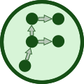
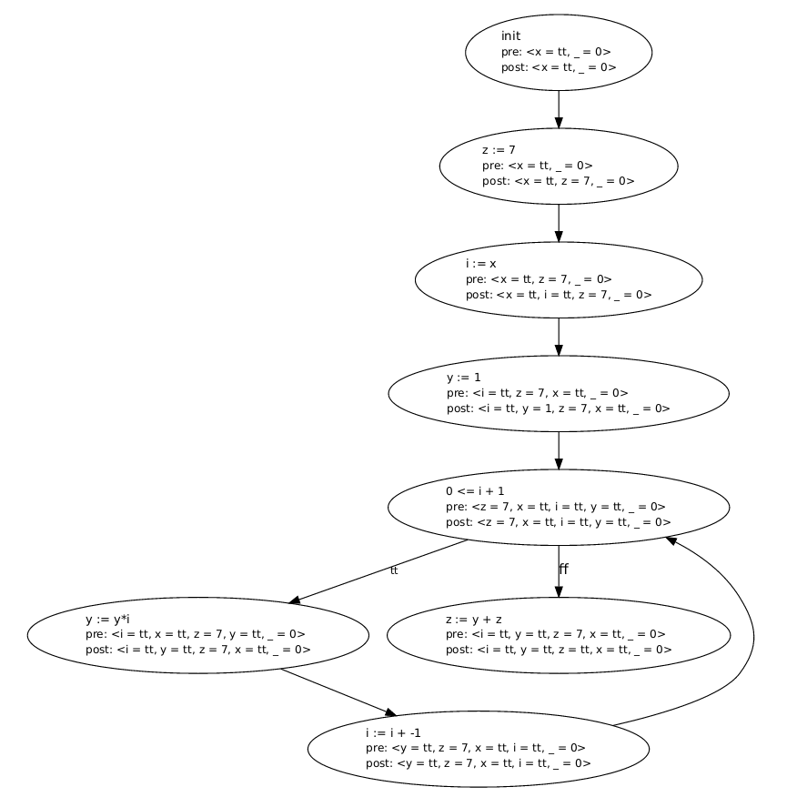
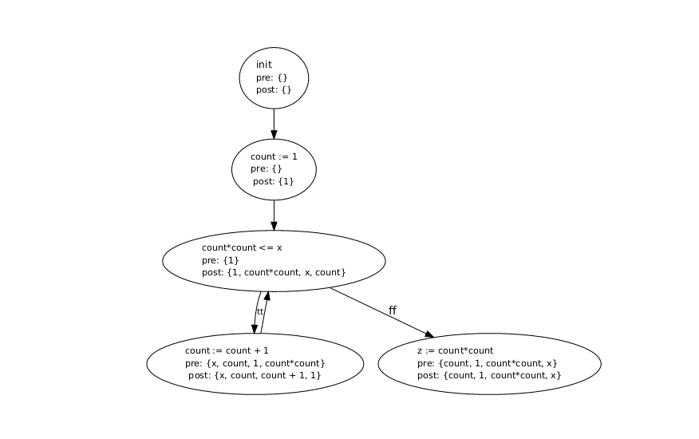

**Note**: This is a programming lab and this page holds the description of the tool that is to be implemented.
- For **doing the lab**, checkout the `master` branch
  - See [`lab/instructions.md`](lab/instructions.md) for instructions
  - See [`lab/explanations.md`](lab/explanations.md) for further project-related explanations on Rust 
- For the **solution**, checkout the `solution` branch (may be unavailable in this repo)

# Flanelly: A Flow Analyzer for *WHILE*

 

This program takes a *WHILE* program and performs one of the following flow analyses on it:

- Constant Propagation
- Available Expressions

The analysis is done via the Maximal Fixed Point (MFP) method and results in an annotated CFG. As a helper tool, it is possible to run the *WHILE* program through an interpreter.

## Usage

`cargo run` compiles and starts the program. There are two modes:

1) Interpreter
   - Choose argument `-i n` where `n` is the input, i.e. the initial value of the `x` variable
   - **StdIn**:  A *WHILE* program
   - **StdOut**: Value of variable `z`

2) Analyzer (default)
   - Choose options `-c` or `-a`
     - Option `-c`: Constant Propagation (default)
     - Option `-a`: Available Expressions
   - **StdIn**:  A *WHILE* program
   - **StdOut**: A CFG that contains annotations provided by the corresponding analysis. It is given in the Graphviz format.

## Examples

1)
    Read the [`least_square_number.while`](examples/least_square_number.while) program and interpret it with input `x = 5`, yielding `z = 9`.
    ```
    $ cat examples/least_square_number.while | cargo run -- -i 5
    9
    ```

2)
    Read the [`const_prop_works.while`](examples/const_prop_works.while) program, analyze it with the constant propagation analysis and display the resulting annotated CFG.
    ```
    $ cat examples/const_prop_works.while | cargo run -- -a > out.dot && xdot out.dot
    ```
     

3)
    Read the [`least_square_number.while`](examples/least_square_number.while) program, analyze it with the available expression analysis and display the resulting annotated CFG.
    ```
    $ cat examples/least_square_number.while | cargo run -- -a > out.dot && xdot out.dot
    ```
    
     


## *WHILE* Programming Language

The *WHILE* language is one of the simplest imperative languages conceivable.

### Abstract Syntax

```
prog      ::= prog_atom ; ... ; prog_atom
prog_atom ::= `skip` | assign | cond | while
assign    ::= x `:=` aexp
cond      ::= `if` bexp `then` prog `else` prog `end`
while     ::= `while` bexp `do` prog `end`

aexp      ::= n | x | `-`aexp | aexp + aexp | aexp * aexp
bexp      ::= aexp `<=` aexp
```

with $n \in \mathbb{N}$ and $x \in \mathit{Var}$. Line comments are introduced by the `#` prefix.

### Semantics

The input of a program is the initial value of the `x` variable. All other variables are initialized to `0`. The output of the program is obtained by running the standard imperative execution model and then extracting the value of the `z` variable.

In short: `x` is initialized to the input, `z` is interpreted as the output (if the program terminates at all).